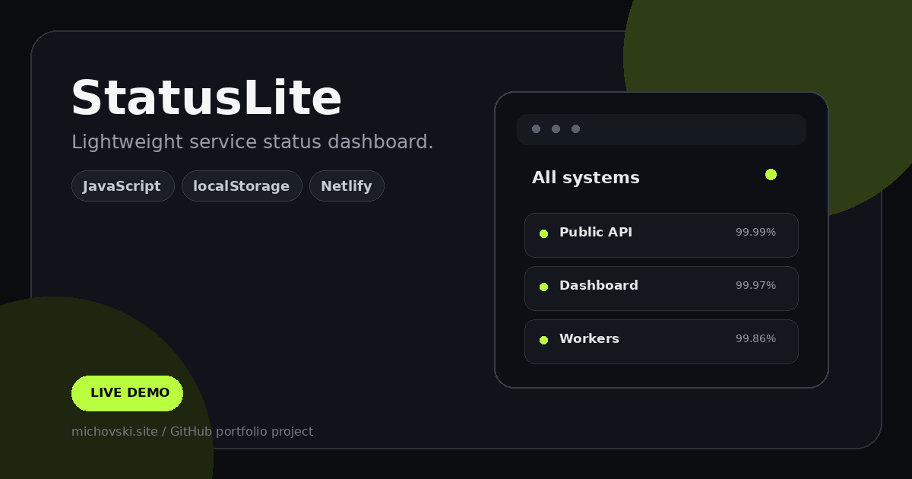

# StatusLite

[](https://statuslite.michovski.site)
[](https://michovski.site)



Lightweight service status dashboard.

## Live

**https://statuslite.michovski.site**

## Features

- Add, remove and update monitored services
- Operational / degraded / outage states
- Incident logging
- Uptime and dashboard metrics
- Browser persistence with `localStorage`
- Responsive layout

## Stack

- HTML5
- CSS3
- Vanilla JavaScript
- localStorage

## Run locally

No build step is required.

```bash
git clone https://github.com/michovskiraw/statuslite.git
cd statuslite
```

Then open `index.html`, or use VS Code + Live Server.

## Notes

This is a personal/demo portfolio project.

---

Built by **Michał Ciechanowski** · [michovski.site](https://michovski.site)
